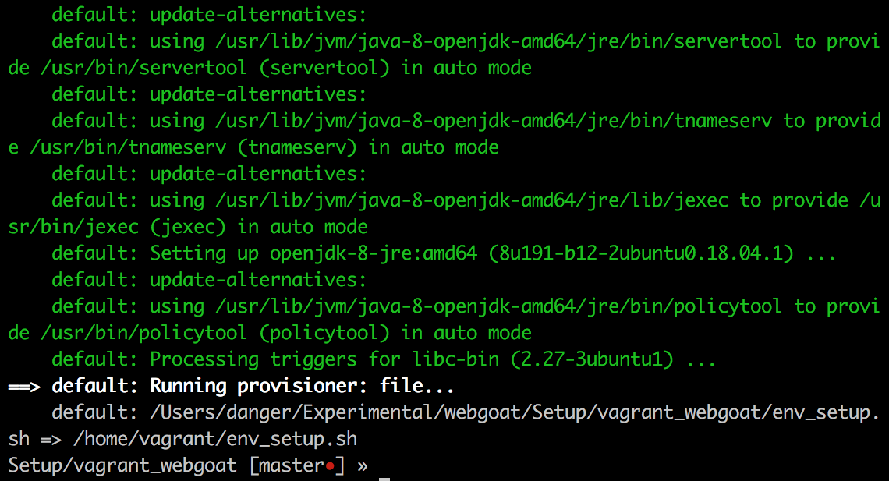
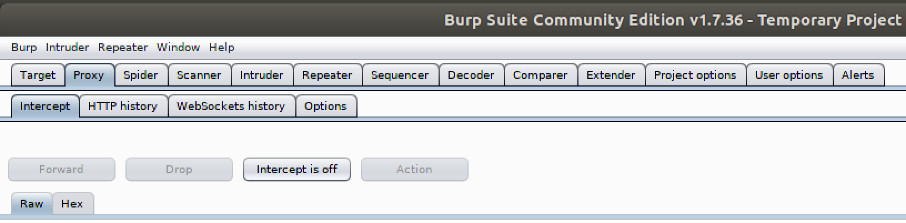
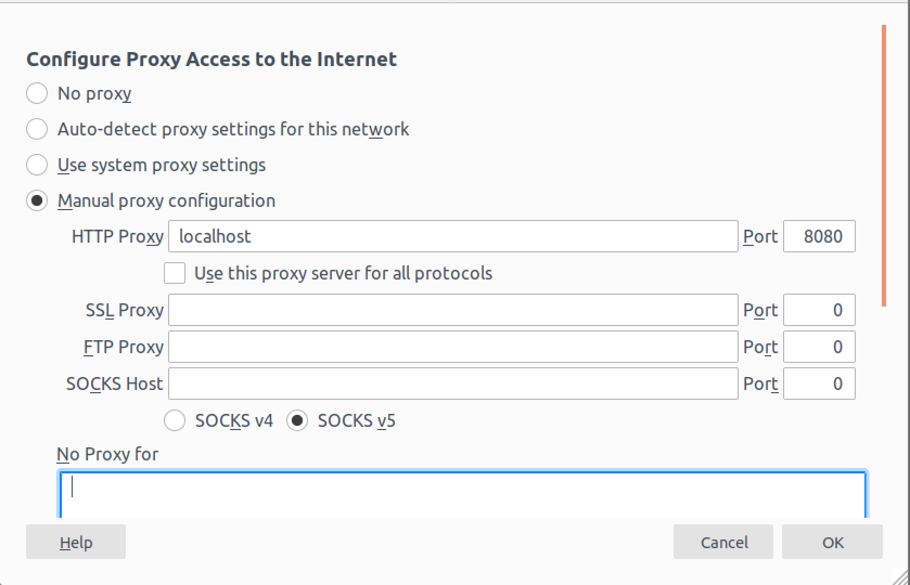
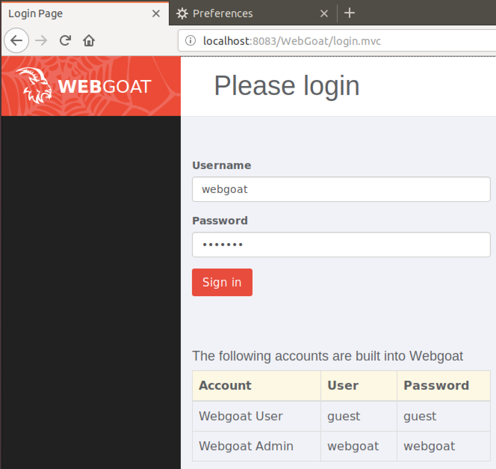
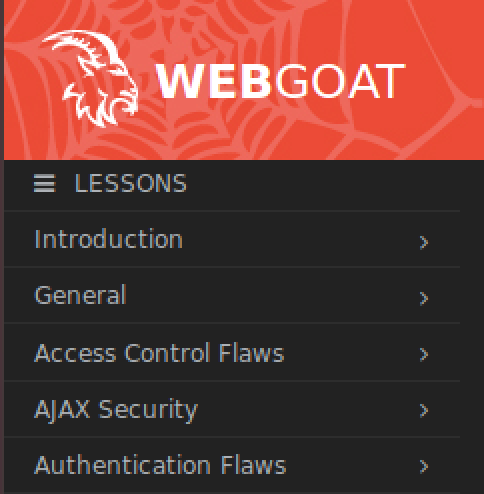
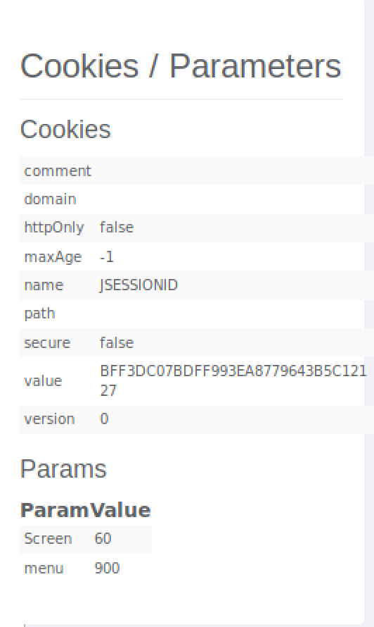
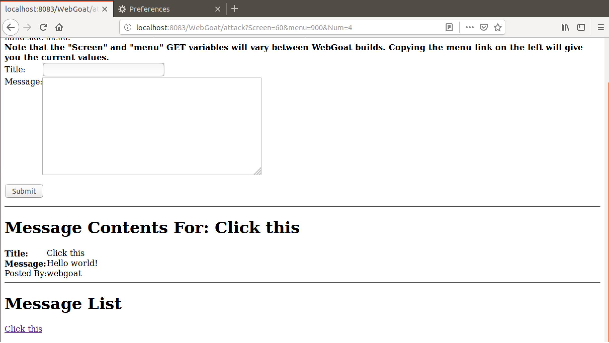

# Vagrant and Legacy WebGoat Environment Setup

Vagrant is a powerful tool that allows you to create and configure virtual machines (VMs).
With Vagrant you can create VMs based on a configuration file, called the Vagrantfile. 

WebGoat is vulnerable web application maintained by OWASP, with the purpose of teaching how to get started with Web Application Pentesting. The Vagrantfile contained in this repo sets up the legacy version of WebGoat, which is version 6.0.1. To get the latest versions, you can fetch the Vagrantfile maintained by them [here](https://github.com/WebGoat/WebGoat/tree/develop/webgoat-images/vagrant-training).

This readme shows you how to run the legacy version of WebGoat in an Ubuntu VM using the Vagrantfile that is included in this repo.

## Requirements
Vagrant needs a virtualization provider. In this document we will be using VirtualBox, however you can use other providers. Thus, you need to have VirtualBox installed or any of the supported providers (additional details found [here](https://www.vagrantup.com/docs/providers/)).

You would also require a text editor to modify the Vagrantfile, and an internet connection.

## Install Vagrant
Vagrant is available to download on most mainstream operating systems. The following link contains the official software packages that download and install Vagrant.

* [https://www.vagrantup.com/downloads.html](https://www.vagrantup.com/downloads.html)

Locate the package corresponding to your operating system, and install the software. This document assumes you are using the Mac OS operating system. However, the Vagrant commands shown will be the same across all supported platforms.

After installation, verify that Vagrant is installed by opening up a command line and entering the command `vagrant -v`.

## Spinning up the environment with Vagrant

First, open up a command line prompt and download this repo with the following command:
	
	git clone https://github.com/dramirez2/vagrant_webgoat.git
	
Next, migrate to the `vagrant_webgoat` directory and  spin up the environment instance with the following commands:

	cd vagrant_webgoat
	vagrant up
	
When the command is finished executing, it should look like the following:

Once the vagrant command has finished running the provisioning script, you may log in to the VM by clicking on the virtualbox gui window of the VM. The username of the VM is `vagrant` and the password is `vagrant`.

## Starting BurpSuite 

BurpSuite works as a proxy between your web application and your web browser. Thus before starting the WebGoat app, start the BurpSuite tool and configure the web browser to use it as a network proxy.

First, open up a command line prompt and migrate to the folder that contains the jar executables. 

*Note:* they are either stored in the `/home/vagrant` or `/home/vagrant/Downloads` directories.*

	cd ~/Downloads

Then start the Burpsuite proxy by running the following command:

	java -jar BurpSuite.jar 2>1 /dev/null &
	
This command starts the proxy and runs its process in the background.

Once the BurpSuite tools loads, click on `I accept` if prompted, then select the `Temporary Project` option and click `Next`. On the next window, select the `Use Burp defaults` option and click `Start Burp`.

Note that by default the BurpSuite proxy is configured to run in intercept mode, which means all HTTP traffic will be intercepted and must be forwared at an individual basis. 

To disable this, go to the Proxy tab, then click the Intercept tab and click on the `Intercept is on` button to turn it off, as shown below:

For some exercises you want to enable the intercept mode, to enable it follow the previous steps.

Next, open the firefox browser and click on the Preferences tab. Then, scroll to the Network Settings pane and click on the Settings button:

Ensure the proxy settings is configured as shown below:

This makes the web browser route HTTP traffic to localhost on port 8080, which is the default port BurpSuite uses to listen for connections.

## Starting WebGoat

Now that the BurpSuite proxy is running and the web browser is configured to route traffic through it, go back to the command line and run the following command to start the WebGoat app as a background process:

	java -jar WebGoat-6.0.1-war-exec.jar --httpPort 8083 2>1 /dev/null &
	
Note that the WebGoat is running on port 8083.

After waiting for a few seconds for the app to initialize, open up the web browser and enter the URL `http://localhost:8083/WebGoat` in the address bar.

When prompted to login, use one of the accounts provided in the login page:

The exercise categories categories will be contained in the vertical pane to the left:

  
### Individual view of exercises

Some exercises depend on messages being rendered to exploit a vulnerability, such as the Cross-Site Scripting vulnerabilities. 

In the event that you are using the correct input to exploit a vulnerability but nothing is happening, then run the exercise in a separate tab.

First, look for the `Screen` and `menu` parameters that correspond to the exercise you are working on. The following is an example of the parameters for the CSRF Token By-Pass exercise:

Then, open up a new tab and enter the following URL, replacing the appropriate values for each parameter:
	
	http://localhost:8083/WebGoat/attack?Screen=<VALUE>&menu=<VALUE>

The exercise would look like the following:

Now you have the environment setup and can start practicing your web application pentesting skills!
